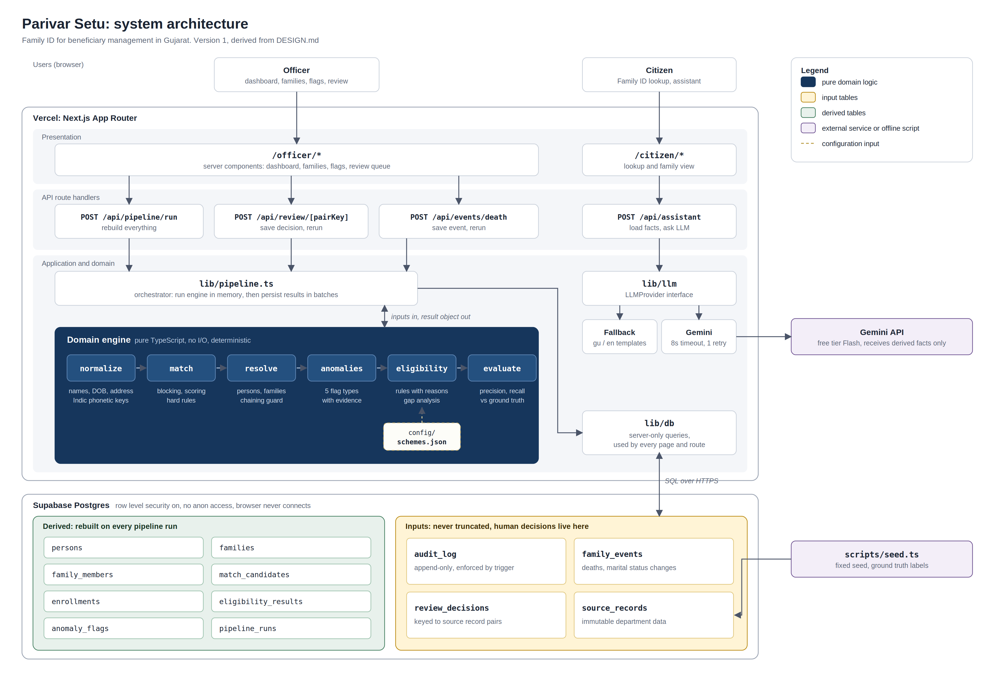
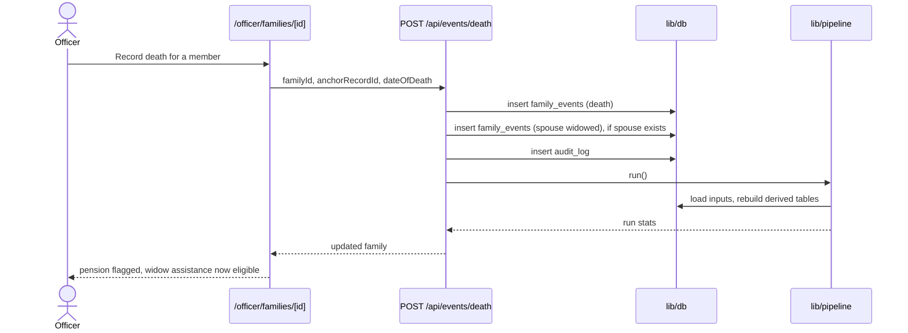
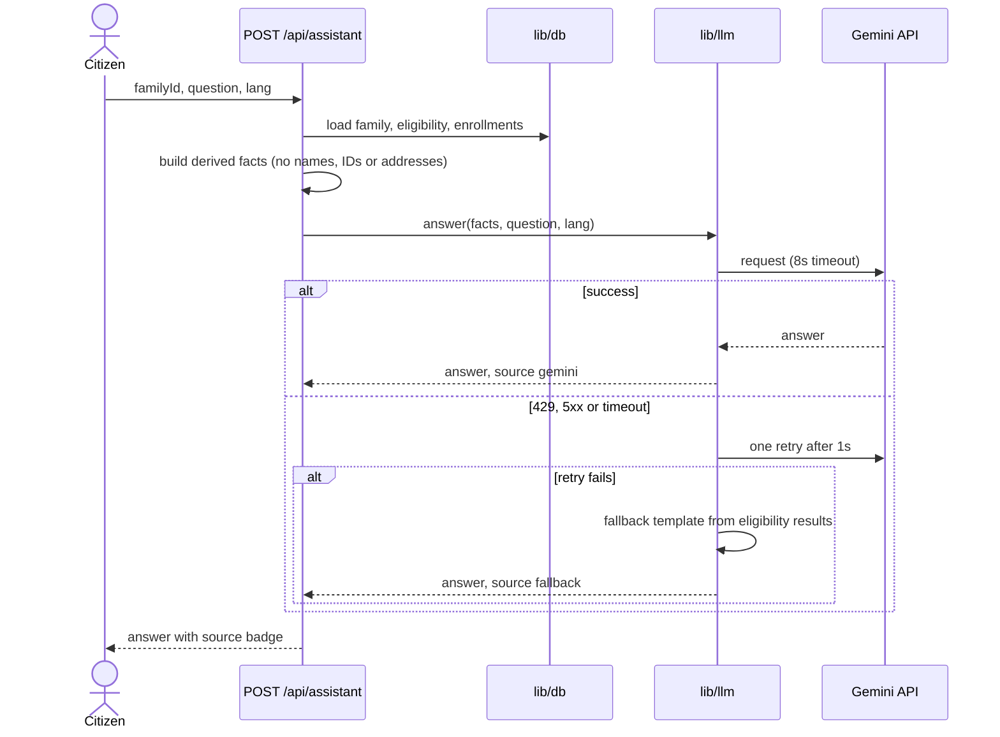

# Parivar Setu - Architecture

Version 1, derived from `DESIGN.md`. Update this file and the diagrams at P7 and P12 so they match the code that was actually built.

## 1. Overview

Parivar Setu builds one Family ID per household from scattered scheme databases, detects leakage, and computes which schemes each family is entitled to. It is a single Next.js application on Vercel with a Supabase Postgres database, a pure TypeScript domain engine at its core, and Gemini used only to phrase answers for citizens.

## 2. Architecture style

**Layered, with a functional core and an imperative shell.**

- The **functional core** (`lib/engine/`) holds every decision the system makes: normalization, matching, clustering, family building, anomalies, eligibility and evaluation. It is pure TypeScript with no database, network, framework or clock access. Inputs go in, one result object comes out.
- The **imperative shell** (route handlers, `lib/pipeline.ts`, `lib/db`, `lib/llm`) does all input and output: reading and writing the database, calling Gemini, serving pages.

Why this split: the engine is where correctness matters most, and pure functions are the easiest code to test, reason about and reproduce. Any decision the system made can be recomputed from the same inputs and will come out identical.

## 3. System diagram

Source files:
- `architecture.mmd`: Mermaid version, renders on GitHub and is quick to edit
- `architecture.png` and `architecture.svg`: presentation version (the SVG can be edited in Figma or Inkscape)

## 4. Components

| Component | Location | Responsibility |
|---|---|---|
| Officer pages | `app/officer/*` | Dashboard, family detail with lineage and score breakdowns, flags, review queue, recording deaths |
| Citizen pages | `app/citizen/*` | Family ID lookup, eligible schemes, assistant chat |
| Pipeline route | `POST /api/pipeline/run` | Rebuilds all derived data from inputs |
| Review route | `POST /api/review/[pairKey]` | Saves an officer's match decision, writes audit entry, reruns pipeline |
| Death route | `POST /api/events/death` | Saves a death event (and spouse status change), writes audit entry, reruns pipeline |
| Assistant route | `POST /api/assistant` | Loads family facts, strips identifying data, asks the LLM layer |
| Pipeline | `lib/pipeline.ts` | Loads inputs, runs the engine in memory, persists results, records the run |
| Domain engine | `lib/engine/*` | All decision logic (see Section 5.1) |
| Scheme rules | `config/schemes.json` | Versioned eligibility rules as data |
| LLM layer | `lib/llm/*` | `LLMProvider` interface, Gemini adapter, fallback templates |
| Data access | `lib/db/*` | Server-only Supabase queries, the only code that talks to the database |
| Seed script | `scripts/seed.ts` | Deterministic synthetic data with ground truth labels |
| Database | Supabase Postgres | Input tables and derived tables (see Section 6) |

**Dependency rule:** dependencies point inward. Pages and routes depend on the pipeline, `lib/db` and `lib/llm`. The pipeline depends on the engine and `lib/db`. The engine depends on nothing but its own types and the scheme config.

## 5. Key flows

### 5.1 Run resolution

Triggered by the dashboard button, by the seed script, and after every review decision or life event.

```mermaid
flowchart LR
  subgraph LOAD["Load"]
    A["source_records<br/>review_decisions<br/>family_events"]
  end
  subgraph ENGINE["Engine (pure, in memory)"]
    B["normalize"] --> C["block and score pairs"] --> D["apply review decisions"] --> E["cluster + chaining guard"] --> F["build families"] --> G["apply family events"] --> H["derive enrollments"] --> I["detect anomalies"] --> J["eligibility + gaps"] --> K["evaluate vs ground truth"]
  end
  subgraph SAVE["Persist"]
    L["truncate derived tables"] --> M["insert in batches of 500"] --> N["pipeline_runs + audit_log"]
  end
  A --> B
  K --> L
```

Two consecutive runs on the same inputs produce identical results, including every Person ID and Family ID.

### 5.2 Record a death

### 5.3 Citizen assistant

### 5.4 Page reads

Pages are server components. They read through `lib/db` on the server and render HTML. The browser never receives database credentials and never queries Supabase.

## 6. Data architecture

Tables are split by who owns the truth:

| Group | Tables | Rule |
|---|---|---|
| Inputs | `source_records`, `review_decisions`, `family_events`, `audit_log` | Never truncated. Source records are immutable. Audit log is append-only via a trigger. |
| Derived | `persons`, `match_candidates`, `families`, `family_members`, `enrollments`, `eligibility_results`, `anomaly_flags` | Truncated and rebuilt on every run |
| Run history | `pipeline_runs` | Appended on every run, holds counts, leakage estimate and precision/recall |

**Stable keys for human decisions.** Review decisions are keyed by the pair of source record IDs, and family events by the person's anchor source record ID. Derived IDs can change when matching logic improves, but source record IDs never do, so officer work survives every rebuild and every engine change.

**Deterministic IDs.** Persons are numbered in order of their anchor record ID, families in order of their smallest ration card reference. `GJ-FID-000142` stays the same family across runs.

**Temporal membership.** `family_members` has `valid_from` and `valid_to`. A partial unique index allows only one current family per person while keeping membership history.

## 7. Deployment

| Piece | Where |
|---|---|
| App, pages, route handlers | Vercel |
| Database | Supabase (managed Postgres) |
| LLM | Gemini API, free tier Flash model |
| Schema | SQL migrations in `supabase/migrations/` |
| Initial data | `scripts/seed.ts`, then one pipeline run |

Environment variables: `NEXT_PUBLIC_SUPABASE_URL`, `SUPABASE_SERVICE_ROLE_KEY`, `GEMINI_API_KEY`, `GEMINI_MODEL`, optional `AS_OF_DATE`. The model name is configuration, so switching models needs no code change.

The full pipeline on the seed data (about 1,100 records) runs in a few seconds, well inside a serverless function's time limit.

## 8. Security and privacy

- Row level security is enabled on every table with no policies, so the public anon key can read nothing.
- The service role key exists only in server environment variables.
- National IDs are stored as a hash plus the last 4 digits, and shown masked.
- The LLM receives only derived facts: relations, age bands, income band, eligibility results. Never names, IDs, villages or addresses. This matters because free tier inputs may be used by the provider to improve models.
- All data is synthetic.
- Every state change is written to an append-only audit log.
- No authentication in the demo; the role toggle is labeled as demo mode.

## 9. Reliability and failure handling

| Failure | Behavior |
|---|---|
| Gemini rate limit (429), server error or timeout | One retry after 1 second, then a templated answer built from eligibility results. The reply shows its source. |
| Gemini key missing | Fallback answers only; the rest of the app is unaffected |
| Pipeline fails midway | Inputs are untouched; rerunning rebuilds derived tables from scratch |
| Officer decision or death recorded, then engine logic changes | Decisions and events are keyed to source records and reapplied on the next run |
| Duplicate button clicks | Rerunning is safe because the pipeline is deterministic |

Known gap: truncate and reinsert is not wrapped in one database transaction, so a crash during persistence can leave derived tables partially filled until the next run.

## 10. Scaling to state level

The demo handles about 1,100 records. Gujarat has roughly 7 crore residents. What would change, and what would not:

**Stays the same:** the engine modules, the scoring rules, the input and derived split, stable keys for human decisions, the LLM boundary.

**Changes:**
1. **Pipeline moves off serverless** into background workers fed by a queue, since a full run no longer fits a request.
2. **Incremental resolution.** New records are blocked and matched only against existing persons, instead of rebuilding everything.
3. **Partitioning by district.** Blocking already requires the same district for most passes, so districts can be resolved in parallel, with a cross-district pass only for UID and DOB blocks.
4. **Blocking keys become indexed columns** so candidate lookup is an index scan rather than an in-memory pass.
5. **Atomic persistence** through staging tables and a swap, closing the transaction gap in Section 9.
6. **Maker-checker approval and document hash checks** on all membership changes, the controls designed against the Haryana record tampering case.
7. **Real identity integration** (eKYC) replaces synthetic UID hashes, with the matcher still handling records that lack IDs.

## 11. Design decisions

| Decision | Alternative considered | Why |
|---|---|---|
| Deterministic rules decide eligibility, LLM only phrases answers | LLM decides eligibility | Government decisions must be reproducible and explainable; an LLM is neither |
| Weighted heuristic matcher with hard rules | Trained ML matcher | No labeled data; every score must be explainable. Weights can later be calibrated with Fellegi-Sunter. |
| Custom Indic phonetic key | Soundex or Metaphone | Those are tuned for English and fail on transliterated Gujarati names |
| Ration card as household anchor | Address plus surname grouping | Ration cards legally define households; one address often holds many families |
| Rebuild derived data on every run | Update derived rows in place | Simpler, deterministic, and safe to rerun; incremental resolution is the scale path |
| Rules as JSON config | Rules in code | Adding a scheme needs no code change; the version is stored with every result |
| LLM behind an interface | Direct Gemini calls in routes | Provider can be swapped by adding one file; fallback lives in one place |
| Single Next.js app | Separate frontend and backend services | One deploy, one codebase, fits the time budget; the layer boundaries keep a later split easy |

## 12. Updating the diagrams

- Edit `architecture.mmd`, then render with `npx @mermaid-js/mermaid-cli -i architecture.mmd -o architecture-mermaid.png`.
- Edit `architecture.svg` in Figma or Inkscape and export `architecture.png`.
- Checkpoints: update both at P7 (safe submission) and P12 (final submission).
